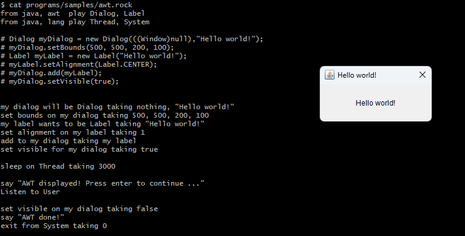

# Native Java support

## Native Java demo



The sample program can be found in the [`programs/samples/awt.rock`](https://github.com/gaborsch/rocky/tree/master/programs/samples/awt.rock) file.

## Using Java features

Rocky has a Rockstar-to-Java binding, that is using the [Rocky OOP](OOP.md) syntax, but the underlying classes are provided by Java. The Java wrapping is using a new value type - NATIVE - to represent Java classes and instances. Only `public` methods and properties can be accessed.

Primitive values (number, boolean, String, null) are implicitly converted to Java and from Java, as well. Array values may be converted to Java implicitly, too, but it is possible to specify the exact Java representation with casting.

Importing (`from java, util play ArrayList`) creates a new global variable with the class name (`ArrayList` in this case) that allows access to static methods and properties. 

Instantiation (`my list will be ArrayList [taking Parameter]`) creates a new variable (`my list`) using a previously imported class (`ArrayList`), the constructor parameters (if any) should follow the `taking` keyword. Constructor is selected based on the actual parameter value types.

Method calling and property access uses similar syntax: `method on object [taking parameter, ...]` and `property on object` respectively. If there are multiple method signatures, the first matching method is used. Method and property names are not case sensitive. Aliases for `on` are  `by`, `in`, `to`, `for`, `from`, `near`.

Return values are retained as-is (and wrapped into a Rockstar Native), unless a primitive value is returned (number, boolean, String, null). `Void` is converted to `mysterious`. 

Type check (`my list is like List`) is possible, including super classes and implemented interfaces. Even two classes or two instances can be checked against each other (`Linkedlist is like List` or `list1 is like list2`). Negation is also allowed (`list1 is not like list2`).

Rockstar functions (including object methods) can implement Java `FunctionalInterface`, enabling native Java methods to call back to Rockstar (see [functional_interface.rock](programs/tests/fixtures/Rocky_ext/native/functional_interface.rock)).

## Conversion of types

It is possible to cast a Rockstar array to a native object with a specific type. 

```
from java, lang play Long, Double, String, Short
from java, util play List, LinkedList, Arrays, Map

Let V be 12.3
Cast V with Short (V will be a native object of type Short, value is truncated to 12)

rock X with 1, 2, 3                                       (create Rockstar array)
cast X into ArrayListOfLongs with List, Long              (cast to ArrayList<Long>)
cast X into LinkedListOfDoubles with LinkedList, Double   (cast to LinkedList<Double>)
cast X into ArrayOfStrings with Arrays, String            (cast to String[])

let M at "one" be 1
let M at "two" be 2
cast M into HashMapOfStringAndLong with Map, String, Long (HashMap<String,Long>)
```
The above statements cast Rockstar Arrays into native Java objects. `List` defaults to `ArrayList`, `Map` defaults to `HashMap`. Converting to a Java array is done with casting to `Arrays`. It is even possible to cast to complex parameterised types, e.g. `cast X with List, Map, List, String, List, Short` results a value with type `ArrayList<HashMap<ArrayList<String>,ArrayList<Short>>>`

Similarly, returned non-primitive values must be converted back if we want to access them within Rockstar. These types include `BigDecimal`, `BigInteger`, all `List`, `Map` and array types.

```
(continuing the above example)
cast V (V is cast back - note that the value is 12 now)
cast ArrayListOfLongs into X2        (X2 is a Rockstar array)
cast ArrayOfStrings into X3          (X2 is a Rockstar array)
cast HashMapOfStringAndLong into M2  (X2 is a Rockstar associative array)
```
